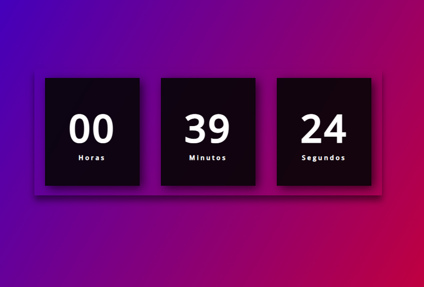

# RealTime

Este projeto objetiva o desenvolvimento de uma aplicação WEB para aprender um pouco sobre alguns conceitos de HTML, CSS e Javascript para iniciantes.

<p align="center">
  <a href="#"></a>
  <a href="#"></a>
  <a href="#"></a>
</p>

<p align="center">
  
</p>


## Demonstração

https://real-time-dududev.vercel.app/

## Instalação

Clone o repositório com ```https://github.com/EduardoPH/RealTime```

Para rodar o projeto, abra o arquivo ```index.html```

## Autores

- [Eduardo Mendes](https://www.github.com/EduardoPH)
